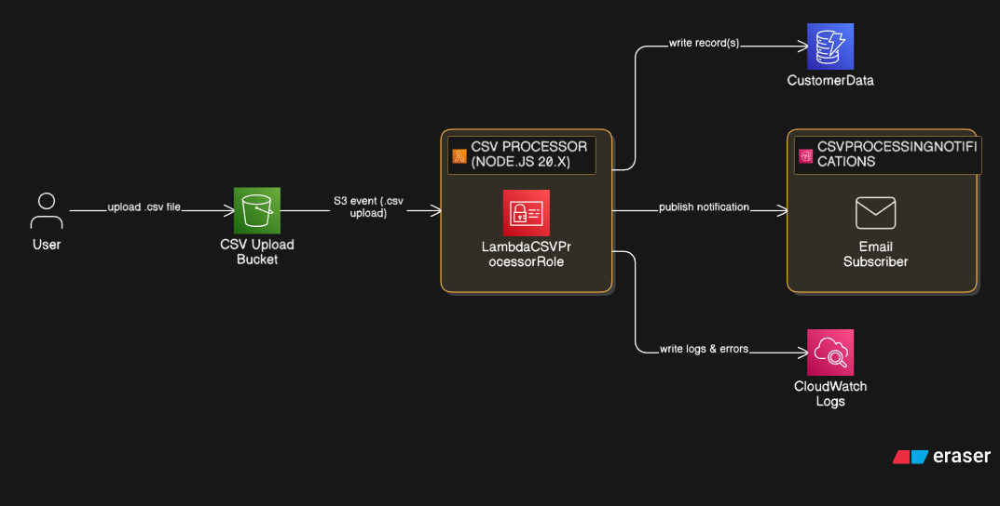
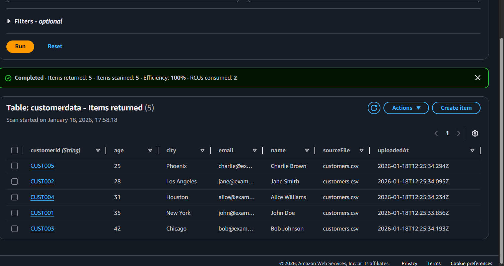
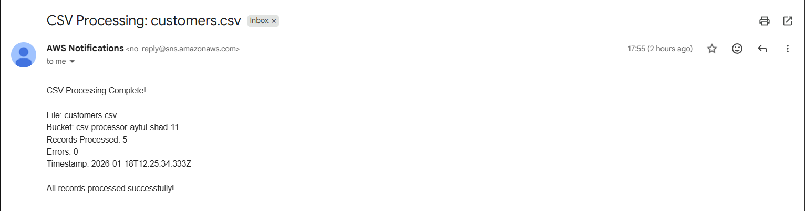

## 🎯 What You'll Learn

- S3 event notifications
- Lambda S3 integration
- CSV parsing in Node.js
- DynamoDB PutItem operations
- SNS email notifications
- IAM execution roles vs resource policies
- CloudWatch log monitoring
- Error handling and DLQ

## 🔧 AWS Services Used

| Service | Purpose |
|---------|---------|
| S3 | Store CSV files and trigger Lambda |
| Lambda | Process CSV and orchestrate workflow |
| DynamoDB | Store parsed customer data |
| SNS | Send email notifications |
| CloudWatch | Log monitoring and debugging |
| IAM | Permissions management |

## 📁 Project Structure

project-01-s3-lambda-dynamodb-sns/
├── lambda/
│   └── index.mjs                    # Lambda function code
├── iam/
│   └── lambda-role-policy.json      # IAM policy
├── test-data/
│   ├── customers.csv                # Valid test data
│   └── invalid.csv                  # Error test data
├── screenshots/
│   ├── cloudwatch-logs.png
│   ├── dynamodb-records.png
│   └── email-notification.png
└── README.md                        # This file

## 🚀 Setup Instructions

### Step 1: Create DynamoDB Table
```bash
Table name: CustomerData
Partition key: customerId (String)
```

### Step 2: Create SNS Topic
```bash
Topic name: CSVProcessingNotifications
Protocol: Email
Endpoint: your-email@example.com
```
**Important**: Confirm email subscription!

### Step 3: Create IAM Role
```bash
Role name: LambdaCSVProcessorRole
```
Attach policy from `iam/lambda-role-policy.json`

### Step 4: Create S3 Bucket
```bash
Bucket name: csv-processor-yourname-12345
Region: us-east-1 (or your preferred region)
```

### Step 5: Create Lambda Function
```bash
Function name: CSVProcessor
Runtime: Node.js 20.x
Handler: index.handler
Execution role: LambdaCSVProcessorRole
Timeout: 30 seconds
Memory: 256 MB
```

Upload code from `lambda/index.mjs`

**Environment Variables**:
DYNAMODB_TABLE = CustomerData
SNS_TOPIC_ARN = arn:aws:sns:REGION:ACCOUNT-ID:CSVProcessingNotifications

### Step 6: Configure S3 Trigger
```bash
Event type: All object create events
Suffix: .csv
```

## 🧪 Testing

### Test 1: Valid CSV
```bash
# Upload test-data/customers.csv to S3 bucket
aws s3 cp test-data/customers.csv s3://csv-processor-yourname-12345/
```

**Expected Results**:
- ✅ Lambda triggered automatically
- ✅ 5 records in DynamoDB
- ✅ Email notification received
- ✅ CloudWatch logs show success

### Test 2: Invalid CSV (Error Handling)
```bash
# Upload invalid CSV to test error handling
aws s3 cp test-data/invalid.csv s3://csv-processor-yourname-12345/
```

**Expected Results**:
- ✅ Lambda processes partial data
- ✅ Errors logged in CloudWatch
- ✅ Email shows error count
- ✅ Valid rows still saved to DynamoDB

## 📊 Sample Data

**customers.csv**:
```csv
customerId,name,email,age,city
CUST001,John Doe,john@example.com,35,New York
CUST002,Jane Smith,jane@example.com,28,Los Angeles
CUST003,Bob Johnson,bob@example.com,42,Chicago
```

## 🔍 Debugging

### Check CloudWatch Logs
```bash
# Navigate to CloudWatch → Log groups
/aws/lambda/CSVProcessor
```

### Common Issues

| Issue | Solution |
|-------|----------|
| Lambda not triggered | Check S3 event notification configuration |
| Access Denied on S3 | Verify IAM role has s3:GetObject permission |
| DynamoDB write fails | Check IAM role has dynamodb:PutItem permission |
| No email received | Confirm SNS subscription, check spam folder |

## 📈 Monitoring

### CloudWatch Metrics to Watch
- Invocations
- Duration
- Errors
- Throttles

### CloudWatch Logs
- Event payload
- CSV parsing logs
- DynamoDB write confirmations
- SNS publish confirmations

## 🎓 Exam Takeaways

### IAM Permissions Required
1. **Lambda Execution Role** (Identity-based):
   - `s3:GetObject` - Read CSV from S3
   - `dynamodb:PutItem` - Write to DynamoDB
   - `sns:Publish` - Send notifications
   - `logs:CreateLogGroup`, `logs:CreateLogStream`, `logs:PutLogEvents` - CloudWatch

2. **S3 Resource Policy** (Resource-based):
   - Automatically created when adding S3 trigger
   - Allows S3 to invoke Lambda

### Key Concepts
- **Event-driven**: No manual triggering needed
- **Asynchronous invocation**: S3 → Lambda
- **Error handling**: Try-catch, partial failure handling
- **Idempotency**: Same file uploaded twice = processed twice (exam trap!)

### Exam Questions This Answers
1. "How to automatically process files uploaded to S3?" → S3 event trigger
2. "Lambda can't read S3 file?" → Check IAM execution role
3. "How to notify on Lambda completion?" → SNS integration
4. "Where to view Lambda errors?" → CloudWatch Logs

## 🧹 Cleanup
```bash
# Delete in this order to avoid dependency issues
1. Delete S3 bucket objects
2. Delete S3 bucket
3. Delete Lambda function
4. Delete DynamoDB table
5. Delete SNS topic
6. Delete IAM role
7. Delete CloudWatch log group
```

## 📸 Screenshots

### CloudWatch Logs


### DynamoDB Records


### Email Notification


## ⏱️ Time Investment

- Initial setup: 50 minutes
- Testing: 10 minutes
- Total: ~1 hour


---

